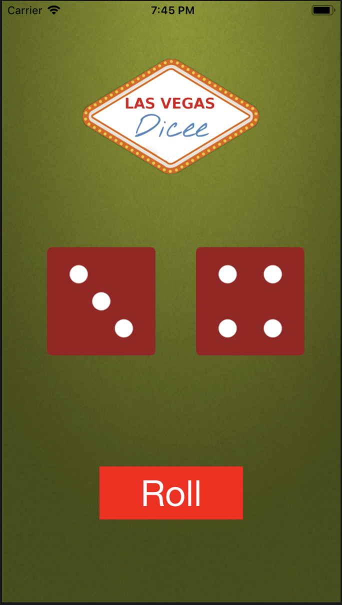

# Dicee

Important Note: This current code is suitable for iphone 8 until updated version coming in the future. 

This IOS app is an dice shaker where users can shake their phone or press the button to enable dice randomizer. Using IOS swift to make this simple app. 



# Getting Started 

Icon design below: 


After opening the app, the user will be direct to the single page app where there are 2 dice and a button. After the user clicks the roll button, the dice will randomly change. Each dice is an individual image and will change based on a simple random number generator. 

# Built With 
* Swift
* IOS

# Wireframe 

Simple 1 Page App

# Code Snippets

The code below is a simple function that takes 2 int variables and makes a random number every time the function is executed. Then is loops through a array of image names to display the correct image with the number generated. 
```
func updateDiceImages () {
    randomDiceIndex1 = Int.random(in: 0 ... 5)
    randomDiceIndex2 = Int.random(in: 0 ... 5)
    
    print(randomDiceIndex1)
    
    diceimageView1.image = UIImage(named: diceArray[randomDiceIndex1])
    
    diceimageView2.image = UIImage(named: diceArray[randomDiceIndex2])
}
```

# Final Thoughts

This one of my first swift applications, and I had a exciting time creating the app and learning the new software to add to my stack. 

# Author
* **Muhammad** - https://github.com/mawais54013